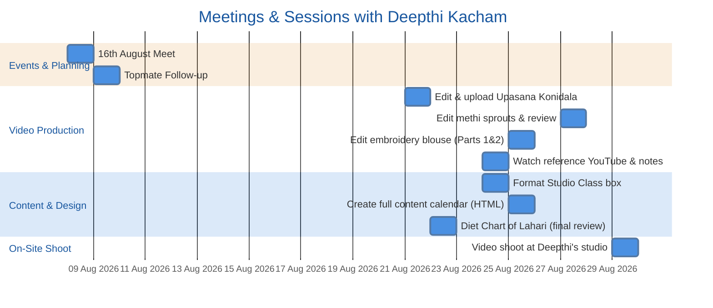

# Visual Timeline of Meetings with Deepthi Kacham

```mermaid
%%{init: {'theme': 'base', 'themeVariables': { 'primaryColor': '#4a90e2', 'secondaryColor': '#d9e6f2', 'lineColor': '#888888', 'fontSize': '14px'}}}%%

gantt
    dateFormat  YYYY-MM-DD
    title       Meetings & Sessions with Deepthi Kacham
    axisFormat  %d %b %Y

    section Events & Planning
    16th August Meet                 :a1, 2026-08-08, 1d
    Topmate Follow‑up                :a2, after a1, 1d

    section Video Production
    Edit & upload Upasana Konidala   :b1, 2026-08-21, 1d
    Edit methi sprouts & review      :b2, 2026-08-27, 1d
    Edit embroidery blouse (Parts 1&2):b3, 2026-08-25, 1d
    Watch reference YouTube & notes  :b4, 2026-08-24, 1d

    section Content & Design
    Format Studio Class box          :c1, 2026-08-24, 1d
    Create full content calendar (HTML):c2, 2026-08-25, 1d
    Diet Chart of Lahari (final review):c3, 2026-08-22, 1d

    section On‑Site Shoot
    Video shoot at Deepthi's studio  :d1, 2026-08-29, 1d
```
